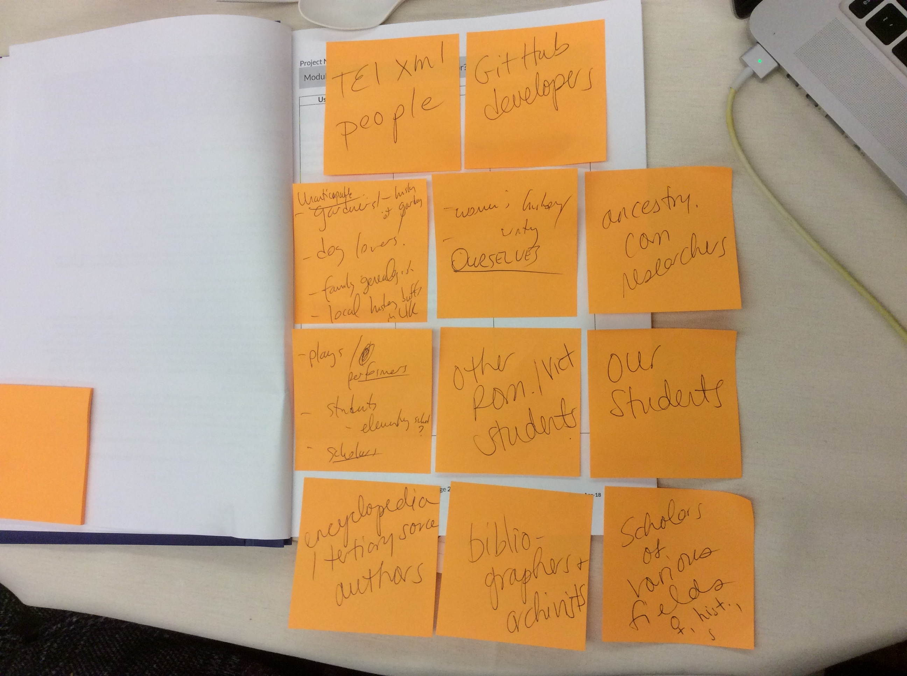

# Working with [Sustainability Roadmap](https://sites.haa.pitt.edu/sustainabilityroadmap/)

## Module A1: 
### Site Index Workflow
1. Coders on the ground: tag named entities. Look up if they are in SI. If not, add. 
    * If problematic, write an update.
    * Known danger of producing duplicate entries.
  
2. @lmwilson and @ebeshero : Collect (harvest) and "dedupe" (merge duplicates), revise, and add to official SI for new releases of the SI.
    * We might want to start naming releases of the SI! 

3. @lmwilson and @ebeshero: Macro level cleanup of entries, standardization of notes, create basis for linked open data.

4. @ebeshero: publishing from SI on the website: (the way annotations are pulled into edition files, 
    * AND separate publications profiling significant names. (not currently delivered, but will be).

5. Lather, rinse, repeat--this is recursive. As we publish, we see issues to correct in the source code. We find duplicate entries, etc.

6. Invade wikipedia and ODNB etc with our rich data!

## Module A2
General notes: Digital projects
* fewer than 3 years 
* over 3 years with the expectation of eventual retirement
* "book time"-- as long as book would last? This is not necessarily the default. 

Phases: 
* **Active Creation**: The project is being created, developed, updated
* **Ongoing Maintenance**: regular, non-transformative activites to sustain the project are undertaken
* **Retirement**: proactive project management ends, with proactive removal OR graceful degradation

1) and 2) Cathedral scale. Letters are forever and SI , Lit editions more finite and less pressing. However, in 10-15 years the senior editors will start retiring. We need to package up the project to train up a new generation of scholar-coders on this project who will sustain the letters and SI activity. And we need to Teach and Document our work for that to happen. 

--Next generations may be to us as we are to Coles? Our interpretations will become dated. However, the data on named entities, document sources, etc should be stable, though software support will change.  

2) Lifespan why? Because economic (time), financial (no regular funding), intellectual (scale of edition projects)

3) "Mid-morning phase": 
* dawn was conceiving the project / writing the codebook
* now we're working out bugs, and publishing more things, changing the interface
* once literary modules are in development and SI encoding stabilized, it'll be "Noon": building on established precedents. 

4) Next phase of development: (maybe after 5 years)
* Take on a wider scale of years (not just 1819-1825, but moving backward + forward in time
* Writing for a big grant again. 

## Module A3: Who's visiting?

Who uses your project?

Why do they use it? what needs do they have?

What do you imagine they get out of it? 

General notes: we need to be aware of other coding projects looking to learn from us or link with us 

See 

## Module A4 What are the project's sustainability priorities? 

* What is your project's narrative, argument, or mission? Where and how do your intellectual goals unfold?
    * Sidenote: We may be serving our "learn to code" audience more directly right now than the audience for MRM's writings
    * Intellectual goals unfolding in the classroom
    * Deans/admins might not have good sense of what our code means, or how our students are learning from this, or the activity going on behind the website view. 
    * Intellectual goals are unfolding in Box and GitHub--not seen on website b/c long in-progress cycle. 
    * Public presentations / conferences are one way of motivating stages that can be shared. 

* What information is your project intended to convey? How does it convey it?
    * Read MRM's writings
    * Finding MRM's papers (tabular publication)
    * Information about MRM's networks of people, places, documents
    * Information about 19th-century letter writing, how to read postmarks, etc
    * Incomplete conveyance, but some network graphing, some publishing of bibliographies and archival holdings, editions 

* How do you define your project's institutional context? What are its contours and features?
    * multiple institutions, connected as our own network.
    * Annual coding school, Box, e-mail, and social media keep us connected and in contact

* What are the structural components of your project?
    

* What about your project's chosen technologies and/or digital interactivity is most salient to you? What forms does it take? 

Significant Property |  Function on the Project | Designated Communities Served
----------------- | --------------------- |-------------------- 
Box Workspace | Workspace and teaching/research resources | **whole** project team
Site Index integration with editions | sharing new data about 19c contexts | builds linked open data, available knowledge on web 
Schema Code and Codebook | Manage and guide the code, ease selection of tags, provide examples | project team and other coders
oXygen XML Editor | syntax awareness, guiding the code | project team
public-facing website (Apache on Digital Ocean) and eXist-db | publish our data, share code, "surface" SI data in search engines |  all our user groups, project team members' accreditation of work, proofreading. Data surfacing encourages "stumbling upon" our site in quest of named entities we're coding. 
Social Media 2: Blog / Listservs | Announcements, detailed posts about project process | reaches potential new editors, coding school participants, involves our students 
Social Media 3: Ancestry.com | public genealogy trees | finds people with overlapping research interests on historical people and places
GitHub repos (Digital Mitford GitHub Organization) | share and refine code, with version control, our code Documentation repo as well as various development projects | serves project and other coders

Social Media 1: Instagram / Twitter / Facebook | Popularize/ publicize | reaches librarians, archivisits/rare books fans

RANKINGS: We have organized the above properties from first to last in terms of their priorities to our project.

Eventually in course of this workshop, we'll be matching up user-groups with properties we list in A4.

## Module A5: Project Documentation Checklist

Types of Documentation? | Designated a Reliable Site for the Project ? | Accessible by whom? | Funded how?
----------------------- | -------------------------------------------- | ------------------ | ------------- |
Box comments |  No(!) People whose institutions start Box accounts are forced to change accounts  (we lose their identities) | Project team | Box corporate / university
XML comments and TEI Header | Yes (but file/by/file access or XPath-able by a few) | Project team | project team's time and oXygen
Google Docs | No these are ephemeral: for Lisa's use to find info quickly | Project Mgr first, rest of team as we work together | Google
[Codebook](http://codebook.mitford.pitt.edu) | Yes, but we need to phase this out as Digital Mitford 1.0. This Google Doc is inconsistent with our current GitHub and ODD-based documentation. A subproject is to curate and replace this. | Project team and public (coders) | Google
Box files in MRMS Project Support | Yes reliable | Project team | Box corporate
File Directory Structure (in Box, but mappable elsewehere) | Yes reliable | Project team | Us: Project team intellectual time and debate and energy

Hey! We can now run Sustainability workshops on our own! 

# Part II 

## Module B1: Who is on the project team and what are their roles?

### Tools and Tech roles (Tech Infrastructure = part of the institutional base of project)
* Box (via Pitt, sort of) Pitt connection gives us "infinite space" for free as long as PI is at Pitt. Brittle relationship, but vital for most of team's experience of this project's workspace. 
* Digital Ocean supports our web presence:
    * Apache web server (thanks to Apache documentation)
    * Webmin and Digital Ocean
* FileZilla (macro filtering downloads from Box and access to Apache)
* eXist db: publishing editions on site
* pHp: interfaces safely between Apache and eXist-db
* Cytoscape: network graphs 

### People:
* Section:
    * Section Leads: communicate with section editors, updates them on major project issues. Manages section workflow for proofreading and quality control. Negotiates with Lisa and Elisa. 
    * Editors: work on their own time at their speed. 
    * Everyone is involved in Bibliography and Correspondence
    * Everyone is involved (potentially) in Manuscript Archaeology
    * Elisa and Lisa are involved in all sections
    * Drama, Poetry, and Fiction sections are more specialized. (Editors working in one of these sections are not usually working in one of the others)
    
** See our [Digital Mitford Staff] (http://digitalmitford.org/staff.html) which is reading from records of our staff in our site index at [http://digitalmitford.org/si.xml](http://digitalmitford.org/si.xml) ) 
We need to come back to this module in a lot more detail! 
   
[Google Sheet for Module B2](https://docs.google.com/spreadsheets/d/1oHpxaaVpICaSG77Vf2Prmp4kKNBVihLWT7NIpmRbZ6Q/edit?usp=sharing) (Note: internal to Digital Mitford project team)

We just set up a Center for Open Science (osf.io) account to help centralize our various data streams for our project. This unifies all our work under a single ORCID! 
Digital Mitford on OSF: [https://osf.io/he34x/](https://osf.io/he34x/)

## Module C2: File Formats and Metadata

* **Level 1**: When Possible create files using a limited set of known open file format. Create and store descriptive metadat, such astitle, abstract, or keywords, or other info useful for discovery
    *  Maintain 2 complete copies, stored separately
* **Level 2**: Have publicly available documentation, user guides, or other materials that make your work legible to users
    * Maintain 3 complete copies, with at least one copy in a different geographic location. 
    * Transfer all data from heterogeneous types of media to a central storage system.
* **Level 3**: Have a publicly available access and use policy
    * Routinely monitory your storage systems and media for obsolescence.
* **Level 4**: Provide accesss to the parts of the project that have become obsolete or difficult to access via a native environment and/or emulation
    * Have a comprehensive plan in place to keep files and metadata on currently accessible media or systems.
  

What is your desired level? Why?
At least level 3. Probably level 4. Because we need to curate the original codebook.mitford.pitt.edu for the project team to revisit its earliest decisions. 
We can't have less than level 3 b/c everyone on this large-scale project needs the same kinds of access. 

How high a priority is reaching your desire level? (Low / Medium / High)
High. (maintain this level)

What is your current level? Why?
We think, 4, but we do need to update some massive Excel spreadsheets to a more tractable long-term database format.

What resources and actions are required to reach (and maintain) your desired level?
* Get more of our project leaders regularly working with GitHub. 
* New OSF repo centralizes data streams (like Google working documents and GitHub, etc) under a single ORCID. Get everyone involved access to this to find everything quickly. 
* Regularly revisit our standards.
* Deal with Massive Excel Spreadsheets 

## Module C3: File Formats and Metadata

* **Level 1:** When possible, create files using a limited set of known open file formats
    * Create and store descriptive metadata, such as title, abstract, keywords, or other information that is useful for discovery
* **Level 2:** Maintain an inventory of all file formats used in your project 
    * Keep an inventory of metadata file types and sizes 
* **Level 3:** Routinely monitor your file formats for obsolescence issues
    * Store administrative metadata, such as when files were created and with what technologies
* **Level 4:** Perform format migrations, emulations, and other updating activities as needed
    * Store transformative metadata, such as a log of how files have been altered over time
    * Store standard preservation metadata

(Note: Level 4 doesn't necessarily make sense for people who are working in progress actively on projects. These standards are developed for people curating finished projects.) 

Desired level: 4
* Desired action: Extract data on all of our file directories and sizes, and internal file names, types, and sizes. 
* Desired action: Greg's giant Excel spreadsheets on MS archive locations need a format grade. We need a script system to permit data entry in Excel (where it's convenient) and transformation to XML format for access /viewing on the public-facing website 

How high a priority? Low to Medium 
We should generate the inventory of files.
We don't necessarily need to act quickly on the format transfer from Excel. The key thing for us is that the Excel data is being regularly updated (by @ghbondar, our MS Archaeologist.) 

What is your current level and why?
Level 1 b/c we lack the inventory. Level 3 b/c we routinely monitor for obsolescence.

Resources and actions? Time and studying up on code scripts. 

## Module C4: Permissions and Data Integrity

Note: project members are typically the biggest threat to data integrity in the project!

**fixity** keyword: data integrity. actual quality of the bits of data as they're embedded in the real world, and ensuring that the order of bits is maintained. 

* **Level 1**: Identify which project members have login credentials to accounts and services used. 
    * Identify which project members have read, write, move, and delete authorization to individual files
* **Level 2**: Restrict authorizations to only necessary team members.
    * Document access restrictions for services and files
    * Be able to replace/repair corrupted data
    * Create fixity of stable content as fixed intervals
    * Check fixity of stable content in response to specific events or activities
* **Level 3**: Maintain logs of who performs what actions on files, including deletions and preservation actions
* **Level 4**: Perform routine audits of activity and logs

Our logs/logging systems include:
* Google sheets (manually produced). Tells us what assignments are in progress
* Box folder labels, indicating who's assigned what, what's in progress, what needs backlist development. This is done by @lmwilson by hand. 
* Box tracks which files were accessed and altered and when. Version control up 
* GitHub tracks which files were accessed and altered and when. 
* Filezilla: helps us filter aggregate directories and hunt for "old" files.
* XML is tractable from the file-directory level via XQuery, which helps Elisa locate backlists for harvest. 
* Photo logs (@ghbondar maintains original camera file logs from before they were filed in Box) This log could be stored on GitHub for additional support. 

Understand: Box is a workspace, not a sustainable storage space.

What is your desired level and why? Level 4, defined for *our* project as visible via continuous integration

How high a priority is reaching your desired level in this area and why? 
Medium (because we're kind of okay without it, but things would be easier with it. Takes time to learn the tech for continuous integration.)

What is your current level and why?
Level 2.5? In between 2 and 3: We have fixity for file formats. We aren't maintaining logs separate from the software systems (like Box or GitHub or server logs) that are automatically generated. Continuous integration would help this. 

What resources and actions are required to reach your desired level? 
PI needs to learn and develop continuous integration, or recruit some willing and knowledgeable helper for this. 

   
  

    

  
  

